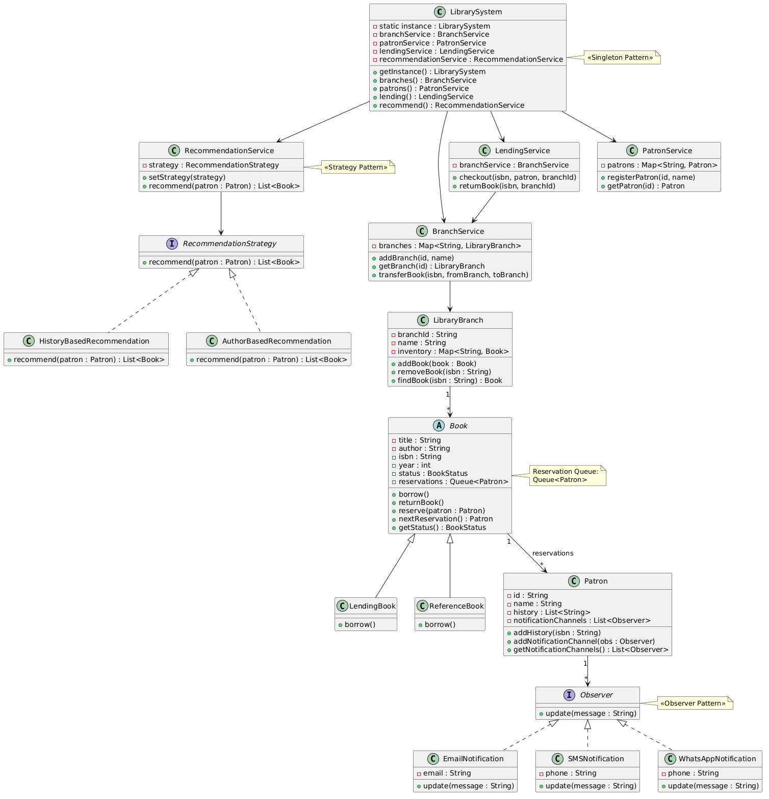

# Library Management System (Java)

A modular **Library Management System** built in **Java** demonstrating clean architecture and multiple **Object-Oriented Design Patterns**.

This project simulates core real-world library operations including:

* Book management
* Multi-branch libraries
* Book borrowing and returning
* Reservation system
* Notification system
* Recommendation system

The system is designed using **SOLID principles** and common **design patterns** to ensure scalability and maintainability.

---

# Features

## 1. Multi-Branch Library Support

Each library branch maintains its own inventory.

Capabilities:

* Add branches
* Store books per branch
* Borrow books from specific branches
* Transfer books between branches

---

## 2. Book Management

Two types of books are supported:

* **Lending Books** – Can be borrowed
* **Reference Books** – Can only be read inside the library

Books contain:

* Title
* Author
* ISBN
* Publication year
* Status (Available / Borrowed / Reserved)

---

## 3. Patron Management

Patrons can:

* Register in the system
* Borrow books
* Reserve unavailable books
* Maintain borrowing history
* Receive notifications

---

## 4. Reservation System

If a book is unavailable:

1. Patron reserves the book
2. Patron is added to a **reservation queue**
3. When the book is returned, the next patron is notified

---

## 5. Notification System

Uses the **Observer Pattern**.

Patrons can subscribe to multiple notification channels:

* Email
* SMS
* Push Notifications
* WhatsApp (extendable)

When a reserved book becomes available, all subscribed channels are notified.

Example output:

```
Email to john@example.com: Your reserved book is available
SMS to +1234567890: Your reserved book is available
```

---

## 6. Recommendation System

Uses the **Strategy Pattern**.

Recommendations can be generated based on different strategies:

* Borrowing history
* Popular books
* Genre preference (extendable)

Example:

```
Recommended Books:
ISBN1
ISBN2
ISBN3
```

---

# Design Patterns Used

## 1. Singleton Pattern

Ensures a single instance of the core system.

Class:

```
LibrarySystem
```

Purpose:

* Central access point
* Manage all services

---

## 2. Factory Pattern

Used to create different types of books.

Class:

```
BookFactory
```

Example:

```java
Book book = BookFactory.createBook(
    BookType.LENDING,
    "Clean Code",
    "Robert Martin",
    "ISBN1",
    2008
);
```

---

## 3. Observer Pattern

Used for the **notification system**.

Components:

```
Observer (interface)
EmailNotification
SMSNotification
WhatsAppNotification
```

Patrons subscribe to notification channels.

---

## 4. Strategy Pattern

Used for **recommendation algorithms**.

Interface:

```
RecommendationStrategy
```

Implementations:

```
HistoryBasedRecommendation
PopularityBasedRecommendation
```

---

# Project Structure

```
libraryManagementSystem
│
├── core
│   └── LibrarySystem
│
├── entity
│   ├── Book
│   ├── Patron
│   ├── LibraryBranch
│   └── BookStatus
│
├── factory
│   └── BookFactory
│
├── observer
│   ├── Observer
│   ├── EmailNotification
│   ├── SMSNotification
│   └── WhatsAppNotification
│
├── repository
│   └── PatronRepository
│
├── service
│   ├── BranchService
│   ├── BookService
│   ├── LendingService
│   ├── PatronService
│   └── RecommendationService
│
└── Main.java
```

---

# Class Diagram

Below is the class diagram representing the architecture of the Library Management System.



# System Architecture

The system is divided into layers:

### Core Layer

Controls system initialization.

### Service Layer

Contains business logic.

Examples:

* LendingService
* PatronService
* BranchService

### Entity Layer

Represents real-world objects.

Examples:

* Book
* Patron
* LibraryBranch

### Pattern Layer

Implements reusable design patterns.

---

# Class Diagram

See the class diagram below:

```
docs/class-diagram.png
```

It illustrates:

* Core services
* Entity relationships
* Observer pattern
* Strategy pattern
* Multi-branch inventory

---

# How to Run

### 1. Clone the repository

```
git clone https://github.com/yourusername/library-management-system.git
```

### 2. Compile

```
javac Main.java
```

### 3. Run

```
java Main
```

---

# Example Workflow

```
1. Add Branch
2. Add Book
3. Register Patron
4. Borrow Book
5. Reserve Book
6. Return Book
7. Get Recommendations
```

---

# Future Improvements

Possible enhancements:

* Database persistence
* REST API
* Web UI
* Book search
* Fine calculation
* Admin roles
* Distributed branch system

---

# Learning Outcomes

This project demonstrates:

* Object-Oriented Design
* SOLID principles
* Design Patterns in practice
* Scalable system architecture
* Clean Java code organization

---

# Author

Subramanian


